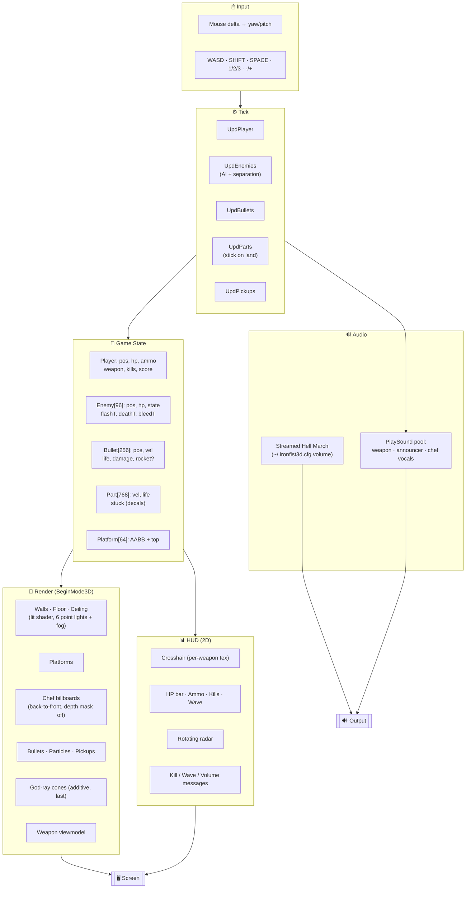
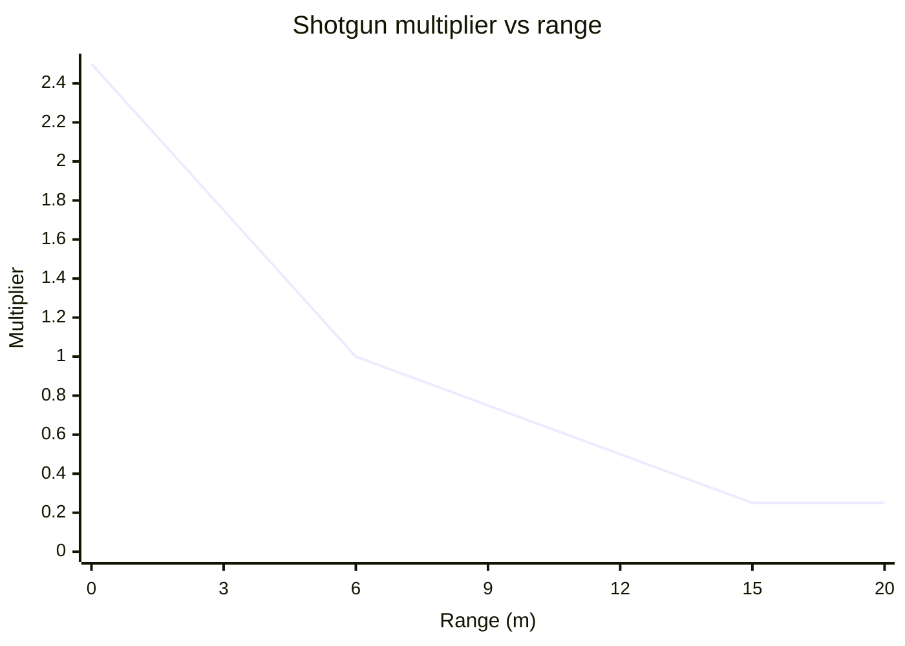
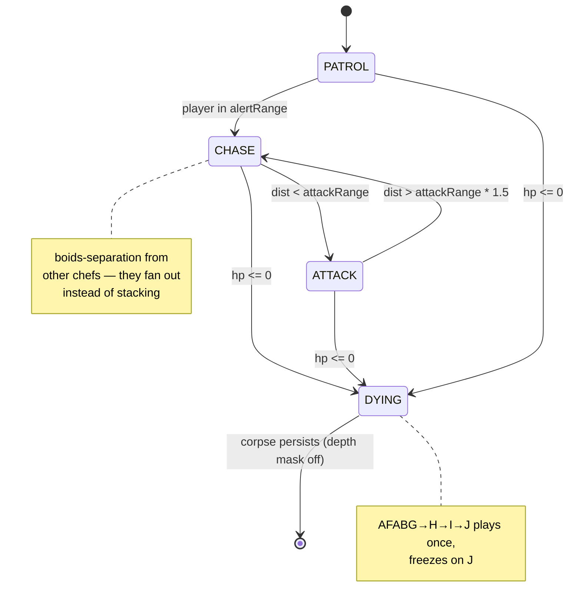
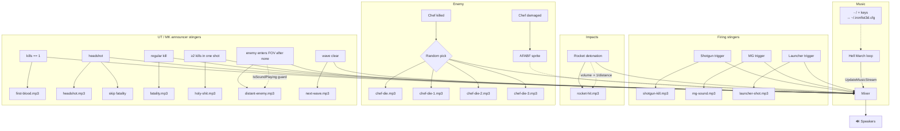

# ⚔️ IRON FIST 3D

**A native macOS Duke-Nukem-style FPS built from scratch in C with raylib.**

One `game.c` file. No engine. No scripting layer. Real OpenGL, real audio, real
3D collision. You fight an escalating horde of **chefs** through an industrial
arena with Q3-style stairs, launcher splash damage, and an honest-to-god C&C
Red Alert soundtrack.

```
    ╔════════════════════════════════════════╗
    ║  1 - SHOTGUN     2 - MG     3 - LAUNCHER ║
    ║  WASD move  ·  MOUSE aim  ·  LMB fire    ║
    ║  SPACE jump · SHIFT sprint · -/+ music   ║
    ╚════════════════════════════════════════╝
```

---

## 🎮 Play

```bash
brew install raylib
./run.sh               # kills any running instance, rebuilds, opens the app
```

Or just:

```bash
make run
```

---

## 🏛️ Architecture



---

## 🔫 Weapons

| Key | Weapon                    | Fire rate | Damage          | Ammo      | Notes |
|-----|---------------------------|-----------|-----------------|-----------|---|
| **1** | **Shotgun** (Browning)  | 0.59s     | 15 × 8 pellets  | 32 shells | Distance-scaled: **2.5× at 0m**, 1.0× at 6m, 0.25× floor at 15m+ |
| **2** | **Machine Gun** (MP40)  | 0.09s     | 18              | 120 rounds | Full-auto · RIFGA muzzle flash overlay |
| **3** | **Launcher** (Panzerschreck) | 0.96s | 200 direct + 200 splash | 8 rockets | Splash 5m radius · you take 30 self-damage if close |

### Shotgun damage falloff



### Per-weapon customisation (`g_wep[]`)

Every weapon is a row in a table — frame list, scale, and per-weapon
horizontal/vertical offset (fraction of screen). Adding a new sprite weapon
is one line.

| Field     | Example                                             |
|-----------|-----------------------------------------------------|
| `folder`  | `browning`                                          |
| `frames`  | `BA5GA0, BA5GE0, BA5GB0, BA5GC0, BA5GD0`            |
| `scale`   | `4.4` (screen-pixel multiplier)                     |
| `xShift`  | `-0.01` (1% left)                                   |
| `yShift`  | `-0.085` (8.5% up)                                  |
| `flash`   | Optional full-canvas overlay during fire window      |

---

## 🧟 The Chef

A WolfenDoom boss sprite set (AFAB*) repurposed as the single enemy type,
billboarded to always face the camera.



| Sub-type    | HP×wave | Speed | Damage | Attack rate |
|-------------|---------|-------|--------|-------------|
| **Chef**    | 65      | 6.0   | 10     | 1.5s        |
| **Heavy**   | 145     | 3.6   | 24     | 2.1s        |
| **Fast**    | 42      | 8.8   | 8      | 1.0s        |

All three share the chef sprite; stats diverge. Wave scaling: +12% HP, +0.18
speed per wave.

### Sprite animation frames

| State       | Sprites            |
|-------------|--------------------|
| Walk        | AFABA / B / C / D  |
| Pain (hit)  | AFABF              |
| Death       | AFABG → H → I → J (freezes on J) |

### Separation behaviour

```mermaid
flowchart LR
    E1((Chef 1)) -->|seek + separation| P{{Player}}
    E2((Chef 2)) -->|seek + separation| P
    E3((Chef 3)) -->|seek + separation| P

    E1 <-.push-away<br/>(sep weight 1.4).-> E2
    E1 <-.push-away.-> E3
    E2 <-.push-away.-> E3
```

Within a 1.5m neighbour radius, each chasing chef sums a push-away vector
from every other live chef, blends it 1.4× against the seek vector, and
moves along the normalised result — fanning out instead of conga-lining.

---

## 🧱 Level

- **2D grid walls** (`MAP[20][30]`) rendered as a single lit mesh
- **Q3-style platforms** (`Platform[]`): AABB boxes with a `top` height,
  stacked on the flat floor
- **Step-up collision**: any platform within `STEP_H = 0.55m` auto-climbs,
  taller ones block as walls
- **Ceiling lights**: 6 colored point lights + visible fixtures + additive
  god-ray cones drawn last
- **Atmospheric fog** handled in the fragment shader

```
z=0 ──┐                                                        ┌── z=80
      │  ┌──┐                                                  │
      │  │  │                        ┌───────── platform ──┐   │
      │  └──┘     stairs             │                     │   │
      │         0.45→0.90→1.35       │   deck at y=1.35m   │   │
      │  ┌─────────────────────────► │                     │◄──┤
      │  │                           └─────────────────────┘   │
x=0 ──┴─────────────────────────────────────────────────┴── x=120
```

---

## 🎨 Lighting & rendering

- Custom GLSL shader (embedded as a C string) does per-pixel lighting for
  up to 8 coloured point lights + exponential fog
- Walls, floor, ceiling, and platforms all run through the same shader and
  share the procedural brick texture
- **Enemy billboards** sorted **back-to-front** each frame and drawn with
  `rlDisableDepthMask()` so transparent sprite pixels don't occlude each
  other (major fix — live chefs behind corpses are now visible)
- Blood particles are tiny `DrawCubeV` specks with slight alpha and
  randomised spawn jitter; once they land slowly they become **flat floor
  decals** that fade over ~12 seconds
- Wounded chefs **leak blood** as they walk — faster drip rate the more hurt
  they are

---

## 🔊 Sound logic



**Key mechanics**
- **Distance-scaled explosions**: rocket-hit volume 2.5× point-blank, 0.25×
  floor past 32m (`vol = 2.5 − d·0.07`)
- **Headshot suppresses fatality**: `g_lastHitHead` flag set around
  `DmgEnemy`, read in `KillEnemy` so you don't double up announcers
- **Multi-kill detection**: `g_killsThisShot` reset per-trigger; after the
  pellet loop / splash loop, if ≥2, the Unreal Tournament multi-kill plays
  at 8× volume
- **Anti-spam**: `distant-enemy.mp3` checks `IsSoundPlaying` before
  retriggering so stacked enemy alerts never overlap
- **Persistent volume**: `LoadMusicVol()` reads `~/.ironfist3d.cfg` at
  startup; every `-` / `+` press writes it back

---

## 🎯 Mechanics reference

| Mechanic               | Detail                                                                     |
|------------------------|----------------------------------------------------------------------------|
| Headshot               | Ray-tests the head sphere separately, 2.5× damage, plays `headshot.mp3`     |
| Multi-kill             | ≥2 kills from one trigger pull (or explosion) → `holy-shit.mp3` at 8×      |
| First blood            | Triggers on `kills == 1` per run                                           |
| Wave advance           | Fires when `Alive() == 0` → wave++, next-wave stinger, spawn next batch     |
| Shotgun damage falloff | 2.5× at 0m → 1.0× at 6m → 0.25× floor at 15m+                               |
| Chef separation        | Boids-style, 1.5m neighbour radius, weight 1.4 vs seek                     |
| Step-up collision      | Platforms ≤ 0.55m auto-climb, taller blocks like walls                     |
| Enemy depenetration    | Player pushed out of overlapping live chefs each frame (radius 0.45m)      |
| Floor decals           | Slow-landing blood particles stick at y=0.005 for 10–16s then fade          |
| Bleeding trail         | Any chef with `hp < maxHp` drips blood every 0.08–0.33s (scales with HP)   |
| Fog                    | Exponential in fragment shader, fades towards dark purple                   |
| Cursor                 | `HideCursor + DisableCursor + SetMousePosition` every HUD frame            |

---

## 📁 Repo layout

```
game.c                    ← all the code
Makefile                  ← builds IronFist3D.app with icon + sprites + sounds bundled
run.sh                    ← kill running → make -B → open app
gen_icon.py               ← procedural iron-fist .icns
CLAUDE.md                 ← conventions / asset rules for future dev
sprites/
  browning/ luger/ mp40/ panzerschreck/   weapon viewmodels
  monsters/                               chef frames
  pickups/                                health, ammo
  crosshairs/                             per-weapon crosshair overrides
sounds/
  hell-march.mp3                          looping BG music
  shotgun-kill / mg-sound / launcher-shot / rocket-hit / chef-die*     weapon + chef vocals
  first-blood / headshot / fatality / holy-shit / next-wave / distant-enemy  announcers
```

---

## 🛠️ Build gotchas

- raylib 5.x required (`brew install raylib`)
- The IDE will yell about missing `raylib.h` includes and `Vector3` types —
  those are false positives from the language server. The compiler has the
  include path. Ignore them
- Default raylib font is ASCII-only; don't use em-dashes (—) in `DrawText` —
  they'll render as `?`
- macOS icon cache can be stubborn. If the Dock shows the old icon, run
  `killall Dock` after a build

---

Built one turn at a time. Every feature request, every bug fix, every
"wait make the blood smaller" request, delivered.

🔥 **Cook some chefs.**
