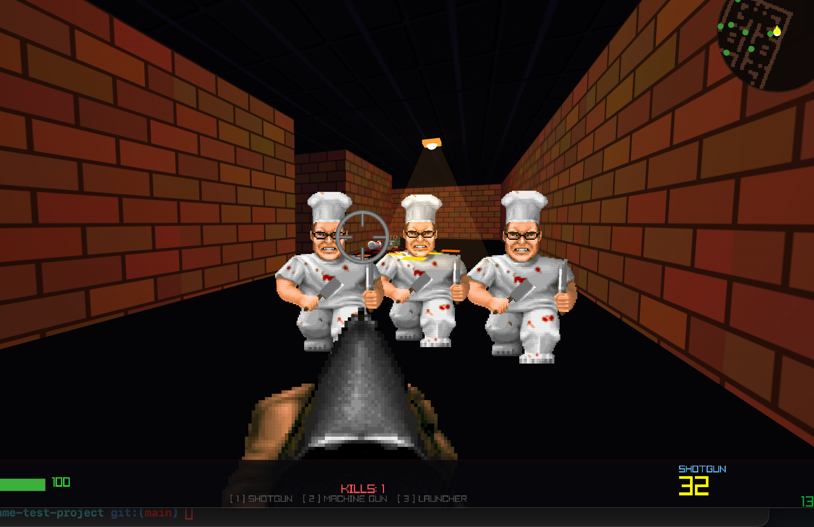
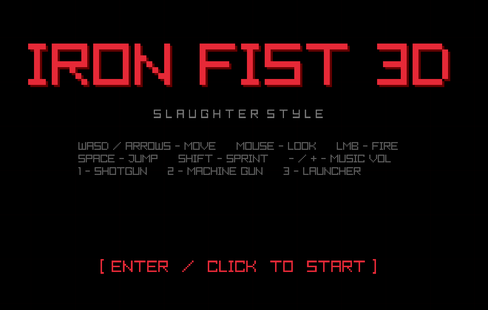
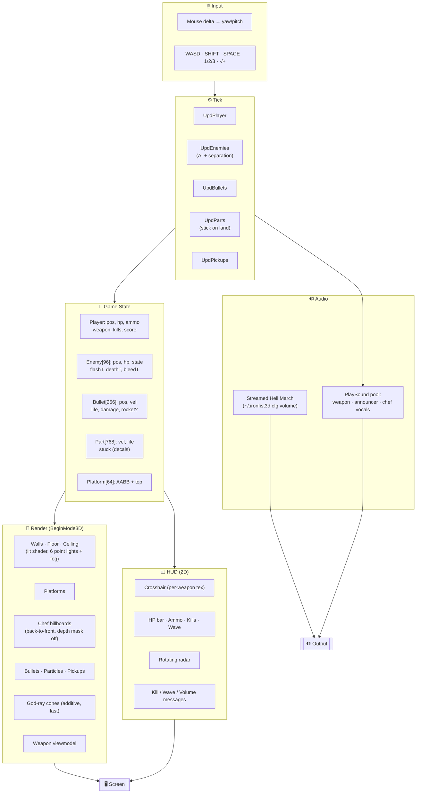
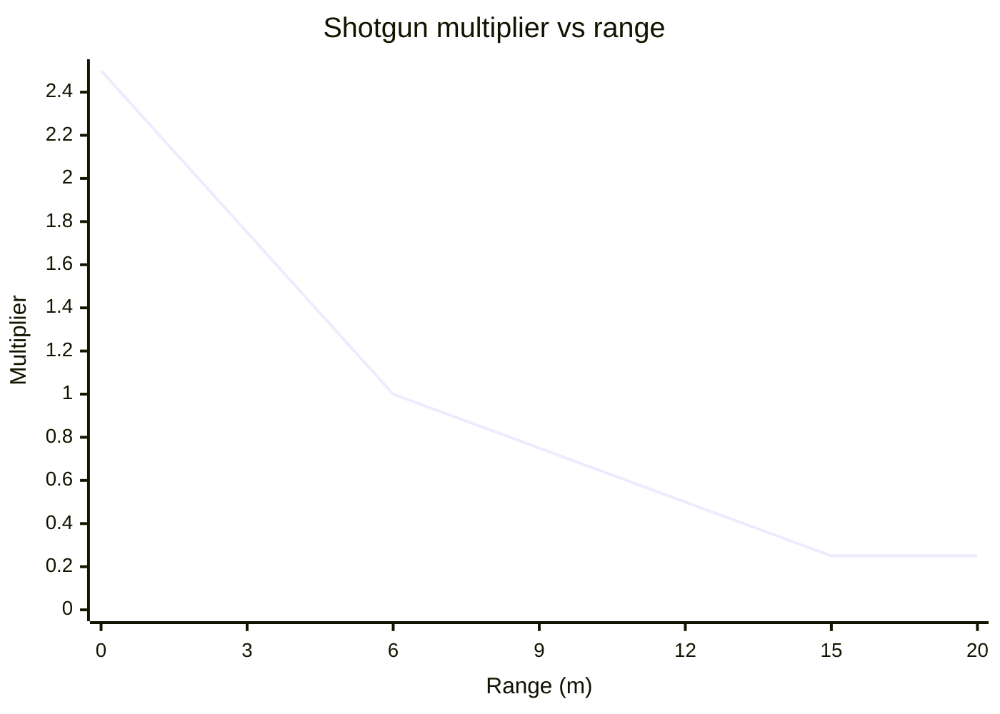
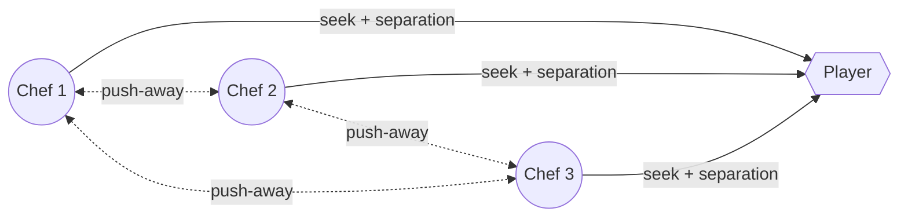
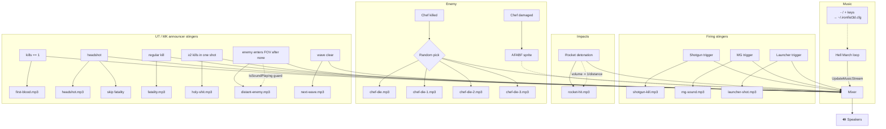

# ⚔️ IRON FIST 3D

### ▶️ [Play in your browser — ironfist.ximg.app/play.html](https://ironfist.ximg.app/play.html)

No install, no download. WebGL 2 required.





**A Duke-Nukem-style FPS built from scratch in C with raylib — native on macOS and Windows, WebAssembly in the browser.**

A `src/game.c` core (plus 3 helper modules and an Objective-C bridge for the
macOS leaderboard POST). No engine. No scripting layer. Real OpenGL, real
audio, real 3D collision. You fight an escalating horde of cleaver-swinging
**chefs** plus 14 other enemy types — Doom-style soldier, cacodemon, and
cyber-demon **wave 2 boss**, Beautiful-Doom revenant / lost soul / pain
elemental, Wolfenstein SS guard, ranged mutant, heavy mech, freedoom
walking eye / baron of hell / spider mastermind / chaingun zombie / tentacle
fiend, plus the recurring spider-mastermind **wave 3+ boss** — through an
industrial arena with textured walls, Q3-style stairs, a tesla cannon that
chains lightning, friendly-fire splash, and a 3-track Red Alert / Soviet
March soundtrack.

```
    ╔══════════════════════════════════════════════════════════╗
    ║  1 - SHOTGUN  2 - MG  3 - LAUNCHER  4 - TESLA            ║
    ║  WASD move  ·  MOUSE aim  ·  LMB fire                    ║
    ║  SPACE jump · SHIFT sprint · P pause · -/+ music · M skip║
    ║  ` (backtick) - dev console (give / god / kill / wave)   ║
    ║  ESC: in-game -> menu   /   menu -> quit                 ║
    ║  A on menu -> ARENA picker (test any of 18 enemies solo) ║
    ╚══════════════════════════════════════════════════════════╝
```

Web build also posts your run to a public leaderboard at
[ironfist.ximg.app/scores.html](https://ironfist.ximg.app/scores.html) when
you die — type 3-character initials, ENTER to submit.

---

## 🎮 Play

**macOS** — builds an `.app` bundle:

```bash
./run.sh               # auto-installs raylib via brew, rebuilds, opens the app
```

Or grab the prebuilt [release](https://github.com/binRick/Iron-Fist/releases).

**Windows** — a single self-contained `IronFist3D.exe`. All sprites and
sounds are baked into the binary as a Win32 RCDATA resource and extracted to
`%TEMP%/IronFist3D/` on first launch, so you only ship one file. Cross-build
from macOS:

```bash
brew install mingw-w64
make windows           # produces dist-win/IronFist3D.exe
```

**Browser** — Emscripten / WebAssembly build. Hosted at
[ironfist.ximg.app/play.html](https://ironfist.ximg.app/play.html), or build
locally: the same `src/game.c` compiles to `dist-web/index.html` (+ `.js` /
`.wasm` / `.data`). WebGL 2 required.

```bash
# one-time: install emsdk, activate it, and source the env
git clone https://github.com/emscripten-core/emsdk vendor/emsdk
./vendor/emsdk/emsdk install latest
./vendor/emsdk/emsdk activate latest
source ./vendor/emsdk/emsdk_env.sh

make web-raylib        # clone + build raylib source for PLATFORM_WEB (first time)
make web-serve         # build + http://localhost:8000/
```

Differences from the native builds:

- Mouse look + audio require a user gesture, handled by a click-to-start gate.
- Music volume does not persist across page reloads (no filesystem).
- No `--debug` flag / debug log.

---

## 🏛️ Architecture



---

## 🔫 Weapons

| Key | Weapon                    | Fire rate | Damage          | Ammo       | Notes |
|-----|---------------------------|-----------|-----------------|------------|---|
| **1** | **Shotgun** (Browning)  | 0.59s     | 15 × 8 pellets  | 32 shells  | Distance-scaled: **2.5× at 0m**, 1.0× at 6m, 0.25× floor at 15m+ |
| **2** | **Machine Gun** (MP40)  | 0.09s     | 18              | 120 rounds | Full-auto · RIFGA muzzle flash overlay |
| **3** | **Launcher** (Panzerschreck) | 0.96s | 200 direct + 200 splash | 8 rockets | Splash 5m radius · you take 30 self-damage if close |
| **4** | **Tesla Cannon**        | 0.45s     | 140 + chain     | 30 cells   | Wide auto-aim cone, 6m range, chains across up to 5 nearby enemies with 85/70/58/48/40% falloff. Distance to target measured to enemy *surface* so wide bosses (1.5m+) can be tagged from a sensible distance. Picked up via the TESLA crate near spawn. |

### Shotgun damage falloff



### Per-weapon customisation (`g_wep[]`)

Every weapon is a row in a table — frame list, scale, and per-weapon
horizontal/vertical offset (fraction of screen). Adding a new sprite weapon
is one line.

| Field     | Example                                             |
|-----------|-----------------------------------------------------|
| `folder`  | `browning`                                          |
| `frames`  | `BA5GA0, BA5GE0, BA5GB0, BA5GC0, BA5GD0`            |
| `scale`   | `4.4` (screen-pixel multiplier)                     |
| `xShift`  | `-0.01` (1% left)                                   |
| `yShift`  | `-0.085` (8.5% up)                                  |
| `flash`   | Optional full-canvas overlay during fire window      |

---

## 🧟 Enemy roster (18 types)

Every enemy uses the same shared AI state machine (`PATROL → CHASE → ATTACK
→ DYING`) but stats, attack style and sprite set differ. Wave scaling:
+12% HP, +0.18 speed per wave (per-enemy values are wave-1 baselines).

```mermaid
stateDiagram-v2
    [*] --> PATROL
    PATROL --> CHASE: player in alertR
    CHASE --> ATTACK: dist < atkR (and same y-level for melee)
    ATTACK --> CHASE: dist > atkR*1.5  OR  LOS blocked  (ranged)
    CHASE --> DYING: hp <= 0
    ATTACK --> DYING: hp <= 0
    DYING --> [*]: corpse persists (depth mask off; flying enemies fall)
```



| #  | Enemy               | HP   | Speed | Dmg | Rate  | Attack                       | Notes |
|----|---------------------|------|-------|-----|-------|------------------------------|---|
| 0  | **Chef**            | 65   | 6.0   | 10  | 1.5s  | Melee cleaver                | AFAB sprites · wave 1 staple |
| 1  | **Heavy chef**      | 145  | 3.6   | 24  | 2.1s  | Melee cleaver                | TORM sprites · tankier, slower |
| 2  | **Fast chef**       | 42   | 8.8   | 8   | 1.0s  | Melee cleaver                | SCH2 sprites · glass cannon |
| 3  | **Boss chef**       | 800  | 7.5   | 40  | 1.6s  | Melee, big hitbox            | BTCN sprites · wave-1 interlude (waves 2/3+ replaced) |
| 4  | **SS guard**        | 80   | 5.0   | 14  | 1.8s  | Hitscan tracer               | PARA sprites · 8-rotational |
| 5  | **Mutant**          | 90   | 4.2   | 14  | 1.4s  | Purple energy ball           | MTNT sprites · ranged projectile |
| 6  | **Mech**            | 260  | 2.6   | 28  | 2.6s  | Heavy rocket                 | MAVY sprites · slow, splash dmg |
| 7  | **Soldier**         | 120  | 5.0   | 14  | 1.4s  | Hitscan tracer               | DOOM-style-Game shotgunner |
| 8  | **Cacodemon**       | 220  | 3.5   | 18  | 2.0s  | Fireball, *flying*           | DOOM-style-Game · joins wave 2+ |
| 9  | **Cyber demon**     | 1500 | 3.8   | 34  | 2.6s  | Twin rockets                 | DOOM-style-Game · **wave 2 boss** |
| 10 | **Revenant**        | 250  | 5.5   | 16  | 1.6s  | Melee placeholder            | Beautiful-Doom · arena-only preview |
| 11 | **Lost soul**       | 60   | 9.0   | 8   | 0.9s  | Charge-melee, *flying*       | Beautiful-Doom · arena-only preview |
| 12 | **Pain elemental**  | 420  | 3.0   | 18  | 2.0s  | Melee placeholder, *floats*  | Beautiful-Doom · arena-only preview |
| 13 | **Tentacle fiend**  | 280  | 5.0   | 18  | 1.7s  | Melee placeholder            | freedoom · armored cyborg w/ tentacles |
| 14 | **Walking eye**     | 700  | 7.0   | 25  | 2.5s  | Resurrects nearby corpses    | freedoom (arch-vile) · brings dead enemies back |
| 15 | **Baron of hell**   | 600  | 4.5   | 30  | 2.0s  | Tanky melee, big hitbox      | freedoom · armored bruiser |
| 16 | **Spider mastermind**| 1500| 4.0   | 35  | 1.5s  | Chaingun walker, huge sprite | freedoom · **wave 3+ recurring boss** (HP scales w/ wave) |
| 17 | **Chaingun zombie** | 95   | 4.6   | 8   | 0.45s | Rapid hitscan burst, 16m     | freedoom CPOS · ranged threat, joins wave 2+ |

Types 10/11/12/13 are **preview-only** — sprites loaded, arena spawn works,
but they currently use chef-style melee placeholder AI; full Doom-style
behaviours (homing missiles, kamikaze charge, lost-soul spawning) are
deferred until they're greenlit for waves.

### Boss interlude

Between waves, a single boss spawns:

| After wave | Boss                  | Type | Notes |
|------------|-----------------------|------|-------|
| 1          | Boss chef             | 3    | Original BTCN cleaver giant |
| 2          | Cyber demon           | 9    | Twin-rocket spectacle |
| 3+         | Spider mastermind     | 16   | Recurring; +12% HP per wave so he scales with you |

### Flying enemy handling

Cacodemon (8), lost soul (11) and pain elemental (12) spawn at a constant
`e->pos.y` (caco 1.5m, lost soul 2.2m, pain elem 2.0m), bypass the
platform-y snap, and on death **fall** to the floor with accelerating
gravity. Once landed, the corpse sprite collapses to 60% height so the
top-down gore texture reads as a flat pile rather than a vertical
billboard with blood floating mid-air.

### Hit volumes

Every enemy has per-type head + body sphere sizes for hitscan (shotgun /
MG) and a per-type cylinder for projectiles (rockets, mutant ball, cyber
rocket, caco fireball). Rockets-pass-straight-through-cyber bugs are
caused by mismatched values here — see `UpdBullets` and `Shoot()` in
`src/game.c`.

### Separation behaviour



Within a 1.5m neighbour radius, each chasing chef sums a push-away vector
from every other live chef, blends it 1.4× against the seek vector, and
moves along the normalised result — fanning out instead of conga-lining.

### Navigation around terrain

Chasing chefs probe 1.5m ahead along their seek direction each tick:

- If the probe hits a **walkable step** (height ≤ `STEP_H`), nothing special —
  they just walk onto it. `PlatGroundAtR` lifts their y as soon as their
  body overlaps the step, so they don't clip into the mesh at y=0.
- If the probe hits a **too-tall platform**, they **skirt** it tangentially
  — perpendicular to the enemy→platform-centre vector, blended 85/15 with the
  pull toward the player. Each chef picks a skirt side from its hash so a
  group fans around both sides instead of piling against one face.
- The probe is staircase-aware: if there's a walkable step between the chef
  and the unreachable platform top, it's *not* flagged as a blocker — the
  chef will take the stairs up instead of detouring.
- Wall collision is **circle-vs-grid**, so chefs don't snag on outside
  corners from a diagonal graze (the old 3-point shoulder test false-blocked
  on corner grazes and forced chefs to slide several metres before turning).
- Dropping off a platform edge no longer strands a chef in the collision
  safety margin around the base — `PlatPenetration` lets them walk away
  from the edge but still stops them from pushing back into the margin.

---

## 🧱 Level

- **2D grid walls** (`MAP[20][30]`) rendered as a single lit mesh
- **Q3-style platforms** (`Platform[]`): AABB boxes with a `top` height,
  stacked on the flat floor
- **Step-up collision**: any platform within `STEP_H = 0.55m` auto-climbs,
  taller ones block as walls
- **Ceiling lights**: 6 colored point lights + visible fixtures + additive
  god-ray cones drawn last
- **Atmospheric fog** handled in the fragment shader

```
z=0 ──┐                                                        ┌── z=80
      │  ┌──┐                                                  │
      │  │  │                        ┌───────── platform ──┐   │
      │  └──┘     stairs             │                     │   │
      │         0.45→0.90→1.35       │   deck at y=1.35m   │   │
      │  ┌─────────────────────────► │                     │◄──┤
      │  │                           └─────────────────────┘   │
x=0 ──┴─────────────────────────────────────────────────┴── x=120
```

---

## 🎨 Lighting & rendering

- Custom GLSL shader (embedded as a C string) does per-pixel lighting for
  up to 8 coloured point lights + exponential fog
- Walls, floor, ceiling, and platforms all run through the same shader and
  share the procedural brick texture
- **Enemy billboards** sorted **back-to-front** each frame and drawn with
  `rlDisableDepthMask()` so transparent sprite pixels don't occlude each
  other (major fix — live chefs behind corpses are now visible)
- Blood particles are tiny `DrawCubeV` specks with slight alpha and
  randomised spawn jitter; once they land slowly they become **flat floor
  decals** that fade over ~12 seconds
- Wounded chefs **leak blood** as they walk — faster drip rate the more hurt
  they are

---

## 🔊 Sound logic



**Key mechanics**
- **Distance-scaled explosions**: rocket-hit volume 2.5× point-blank, 0.25×
  floor past 32m (`vol = 2.5 − d·0.07`)
- **Headshot suppresses fatality**: `g_lastHitHead` flag set around
  `DmgEnemy`, read in `KillEnemy` so you don't double up announcers
- **Multi-kill detection**: `g_killsThisShot` reset per-trigger; after the
  pellet loop / splash loop, if ≥2, the Unreal Tournament multi-kill plays
  at 8× volume
- **Anti-spam**: `distant-enemy.mp3` checks `IsSoundPlaying` before
  retriggering so stacked enemy alerts never overlap
- **Persistent volume**: `LoadMusicVol()` reads `~/.ironfist3d.cfg` at
  startup; every `-` / `+` press writes it back

---

## 🎯 Mechanics reference

| Mechanic               | Detail                                                                     |
|------------------------|----------------------------------------------------------------------------|
| Headshot               | Ray-tests the head sphere separately, 2.5× damage, plays `headshot.mp3`     |
| Multi-kill             | ≥2 kills from one trigger pull (or explosion) → `holy-shit.mp3` at 8×      |
| First blood            | Triggers on `kills == 1` per run                                           |
| Wave advance           | Fires when `Alive() == 0` → wave++, next-wave stinger, spawn next batch     |
| Shotgun damage falloff | 2.5× at 0m → 1.0× at 6m → 0.25× floor at 15m+                               |
| Chef separation        | Boids-style, 1.5m neighbour radius, weight 1.4 vs seek                     |
| Step-up collision      | Platforms ≤ 0.55m auto-climb, taller blocks like walls                     |
| Enemy step-up          | Body-radius snap: chefs climb stairs as soon as their footprint overlaps a step |
| Enemy path probe       | 1.5m look-ahead; skirt too-tall plats, walk through walkable stairs         |
| Enemy wall collision   | Circle-vs-grid, so chefs don't snag on outside corners                     |
| Enemy depenetration    | Player pushed out of overlapping live chefs each frame (radius 0.45m)      |
| Floor decals           | Slow-landing blood particles stick at y=0.005 for 10–16s then fade          |
| Bleeding trail         | Any chef with `hp < maxHp` drips blood every 0.08–0.33s (scales with HP)   |
| Fog                    | Exponential in fragment shader, fades towards dark purple                   |
| Cursor                 | `HideCursor + DisableCursor + SetMousePosition` every HUD frame            |

---

## 🎁 Pickups

| Pickup            | Sprite source                          | Effect                                       |
|-------------------|----------------------------------------|----------------------------------------------|
| Health (CHIKA)    | sprites/pickups/                       | +25 HP                                       |
| Mega-health       | sprites/pickups/                       | +50 HP                                       |
| Shells / bullets / MG / rockets / cells | sprites/pickups/         | Replenish ammo for the matching weapon       |
| **Tesla cannon**  | sprites/pickups/                       | One-time unlock + 30 cells                   |
| **QUAD damage**   | sprites/pickups/quad/ (Icon-of-Sin SCUB) | 4× damage for 30s. Animated cube cycles 6 frames at 5fps with magenta double-ring halo |
| **SPEED boost**   | sprites/pickups/speed/ (freedoom PMAP)   | 1.5× movement for 30s. Cycles the freedoom Computer Map across 4 frames with cyan halo |

Both QUAD and SPEED are world-space billboards that pulse and animate on
the floor. They draw **before** `DrawEnemies` so a chef walking between
camera and pickup correctly occludes the sprite (depth-mask trick — see
`CLAUDE.md`).

---

## 🎵 Music

3-track random shuffle in-game:

- **Hell March** (C&C Red Alert)
- **Funeral March of Queen Mary** (Purcell, Wendy Carlos arrangement)
- **Soviet March** (C&C Red Alert 3)

Pressing **M** during gameplay skips to a different random track from the
playlist (won't repeat the current one). A small "M-SKIP" hint shows
under the kill counter. Track choice is shuffled — each end-of-track
picks a random track that *isn't* the one just finished, so no immediate
repeats. Volume persists to `~/.ironfist3d.cfg` on every `-` / `+`.

Title screen plays a separate menu loop until the player hits ENTER.

---

## 🚨 Rear-arc warning

When an enemy is alive and behind you (within ±90° of the back-facing
arc, ≤25m), the HUD shows two cues:

- A red arrow at the bottom of the screen pointing toward the closest
  rear threat, scaled by distance (close = bigger).
- The minimap rear half is washed with a faint red tint matching the
  same arc.

Both indicators are always-on (no toggle). They stop the moment the
threat moves out of the rear arc or dies. Helps with the "where is that
chaingun zombie shooting me from?" problem in late waves.

---

## 🎮 Other things you'll find

### Arena picker (A on main menu)

18 enemy slots. Arrow keys cycle through cycling sprite + attack-frame
previews; ENTER spawns 8 of that type (or 1 for boss / cyber demon /
spider mastermind) into the arena map. Handy for testing AI / hit volumes
/ animations. Press ESC to return to the menu.

### Dev console (backtick during gameplay)

Quake-style drop-down with `give` / `god` / `kill` / `wave N` / `tp X Z`
/ `pos`. Capability-enhancing commands flag the run as cheated — the
death screen suppresses leaderboard submission and shows "CHEATS USED -
NO LEADERBOARD ENTRY" instead. Resets on every fresh run.

### Pause (P during gameplay)

Stops every Upd*, mutes music + master volume so in-flight one-shots
silence too, releases pointer lock so the cursor's free, and on resume
re-engages pointer lock + drains accumulated mouse delta (otherwise the
camera spins on unpause). Two-line overlay separates the keys: green
"PRESS P - RESUME GAME" / red "PRESS ESC - EXIT TO MAIN MENU".

### High-score leaderboard (web build)

On death you get a 3-character initials selector. Keys: ←/→ pick slot,
↑/↓ cycle A-Z 0-9, type directly to set + auto-advance, BACKSPACE step
back, ENTER submits, ESC skips. The score POSTs to
`https://ironfist.ximg.app/api/scores` along with kills, wave, weapon
last equipped, time played, pickups, shots, and damage dealt — viewable
at [/scores.html](https://ironfist.ximg.app/scores.html). Web uses
`EM_JS` fetch, native macOS uses `NSURLSession` via `src/score_post.m`,
Windows currently no-ops. Server-side validation rejects implausible
runs.

### Sprite browser (S on main menu, macOS dev only)

Press **S** on the main menu (or F8 anywhere) to flip through every PNG
in curated source folders across Beautiful-Doom, DOOM-style-Game, and
the freedoom sprite trove (3000+ sprites). Mouse-navigable sidebar with
scroll-wheel folder switching, a prefix filter for the freedoom monolith
folder, and live filename + sprite preview at variable zoom. Used to
figure out which 4-letter prefix maps to which animation role — REVI is
"pain", RSKE is "walk", REVN is "death" for revenant; CPOS = chaingun
zombie; SPID = spider mastermind, etc. Keys: ←/→ file, [ ] folder, - /
+ zoom, ESC exit. macOS-only because it reads absolute paths to
`third_party/`; gated behind `!PLATFORM_WEB && !_WIN32`.

### Speed-pickup candidate previewer (K on main menu)

Animated grid of 6 candidate pickup sprite sets cycling at 5fps. Used
during development to compare freedoom candidates side-by-side before
picking one to wire as the SPEED boost (PMAP / Computer Map won the v1.3.19
selection). macOS-only.

### ESC navigation

Consistent across every screen:
- **Main menu** ESC → quit
- **Death screen** ESC → quit (post-initials)
- **In-game / paused / picker / sprite browser** ESC → main menu

Implemented by disabling raylib's default exit-on-ESC (`SetExitKey(KEY_NULL)`)
and routing every ESC keypress through per-state handlers in `StepFrame`.

---

## 📁 Repo layout

```
src/
  game.c                  ← main code (~6000+ lines)
  hud.c / .h              ← Doom mugshot HUD + status bar + rear-arc warning
  effects.c / .h          ← particle pool: blood, sparks, decals
  level.c / .h            ← MAP grid + Platform[] + collision predicates
  common.h                ← shared types (Player / Enemy / Pickup / Part / Platform)
  score_post.m            ← macOS NSURLSession bridge for high-score POST
Makefile                  ← macOS .app + Windows single-file .exe + emcc web targets
run.sh                    ← brew-installs deps → make -B → exec the binary in foreground
debug.sh                  ← tail -F /tmp/ironfist-debug.log
gen_icon.py               ← procedural iron-fist .icns
pack_bundle.py            ← flattens sprites/ + sounds/ into dist-win/bundle.dat
                            (embedded into the Windows exe via windres RCDATA)
web/shell.html            ← emscripten click-to-start gate for autoplay + pointer lock
CLAUDE.md                 ← conventions / asset rules / debug-log format for future dev

sprites/
  browning/ mp40/ panzerschreck/  weapon viewmodels (luger archived)
  monsters/                       AFAB/TORM/SCH2 chefs, BTCN boss, MTNT mutant,
                                  MAVY mech, PARA SS guard
  monsters/preview/               soldier / caco / cyber / revenant / lostsoul /
                                  painelem / skel (tentacle fiend) / archvile
                                  (walking eye) / baron / spider / chaingun
                                  (walk_N / atk_N / pain_N / death_N each)
  textures/                       sky.png + wall1..wall5.png (connected-component
                                  flood-fill picks one texture per wall block)
  blood/                          YBL7A..S animated splat decal
  pickups/                        health, ammo, weapon unlocks
    pickups/quad/                   6-frame Icon-of-Sin cube (QUAD damage)
    pickups/speed/                  4-frame freedoom Computer Map (SPEED boost)
  crosshairs/                     per-weapon overrides
  hud/mugshot/                    Doom STF* mugshot tiers

sounds/
  hell-march / funeral-queen-mary / soviet-march  3-track in-game shuffle
  title-music                     menu loop
  shotgun-kill / mg-sound / launcher-shot / rocket-hit / chef-die*  weapon + chef vocals
  first-blood / headshot / fatality / holy-shit / next-wave / distant-enemy  announcers
  tesla-* / mech-* / mut-* / cyber-fire / chaingun                  per-enemy fire samples
  ss-fire / soldier-mg                                              hitscan tracers
  player-ough / chef-hit                                            damage feedback

third_party/                      git submodules (gitignored except the three below)
  Beautiful-Doom/                 GZDoom mod — MONSTERS sprite source for revenant /
                                  lostsoul / painelem, plus the m_*.zc actor scripts
                                  that decode which prefix is which animation
  DOOM-style-Game/                Doom-style-Game project — MONSTERS sprite source
                                  for soldier / caco / cyber
  freedoom/                       BSD-licensed Doom-compatible sprites — source for
                                  tentacle fiend (skel), walking eye (archvile),
                                  baron of hell, spider mastermind, chaingun zombie,
                                  Computer Map pickup

docs/screenshot-1.png             gameplay screenshots
docs/screenshot-2.png
```

---

## 🛠️ Build gotchas

- raylib 5.x required. `./run.sh` auto-installs `raylib` + `pkg-config` via
  Homebrew if they're missing
- The IDE will yell about missing `raylib.h` includes and `Vector3` types —
  those are false positives from the language server. The compiler has the
  include path. Ignore them
- Default raylib font is ASCII-only; don't use em-dashes (—) in `DrawText` —
  they'll render as `?`
- macOS icon cache can be stubborn. If the Dock shows the old icon, run
  `killall Dock` after a build
- Windows: the game includes `<windows.h>` would clobber raylib's `DrawText`,
  `CloseWindow`, `Rectangle` macros — `src/game.c` forward-declares only the
  handful of Win32 APIs needed for the RCDATA resource extraction instead

---

Built one turn at a time. Every feature request, every bug fix, every
"wait make the blood smaller" request, delivered.

🔥 **Cook some chefs.**
